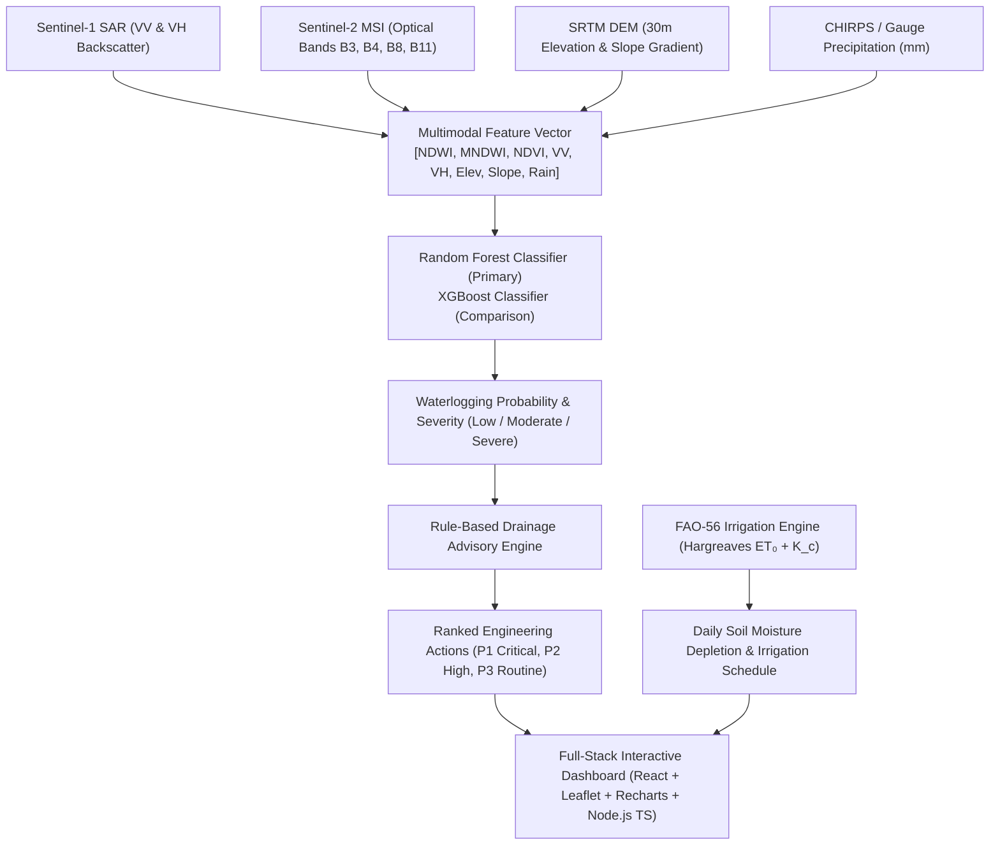

# JalaDrishti AI — Earth Observation Flood Intelligence & Agro-Water Platform

An enterprise-grade multimodal Earth Observation & AI decision-support platform designed for municipal flood resilience, terrain drainage remediation, and precision FAO-56 crop irrigation water balance management across Karnataka.

---

## 🌟 Platform Capabilities
- **Multimodal Flood Mapping**: Sentinel-1 SAR + Sentinel-2 Optical + SRTM DEM + Live Rainfall
- **Karnataka Agro-Climatic Observatory**: High-resolution 10-day forecasts across all 31 Karnataka districts
- **FAO-56 Dual Crop Coefficient Engine**: Precision irrigation scheduling for 100+ Karnataka crops & 12 soil series
- **Hydrological Drainage Decision Matrix**: Automated P1/P2/P3 municipal & field engineering advisories

---

## 🛰️ System Architecture



---

## 🔬 Core Methodology & Mathematical Formulations

### 1. Per-Pixel Feature Extraction
$$\mathbf{X} = [\text{NDWI}, \text{MNDWI}, \text{NDVI}, \text{VV}, \text{VH}, \text{Elevation}, \text{Slope}, \text{Rainfall}]$$
- **NDWI (Normalized Difference Water Index)**: $\frac{\text{Green} - \text{NIR}}{\text{Green} + \text{NIR}} = \frac{B_3 - B_8}{B_3 + B_8}$
- **MNDWI (Modified NDWI)**: $\frac{\text{Green} - \text{SWIR}}{\text{Green} + \text{SWIR}} = \frac{B_3 - B_{11}}{B_3 + B_{11}}$
- **NDVI (Normalized Difference Vegetation Index)**: $\frac{\text{NIR} - \text{Red}}{\text{NIR} + \text{Red}} = \frac{B_8 - B_4}{B_8 + B_4}$
- **Sentinel-1 SAR VV & VH (dB)**: Microwave C-band backscatter ($<-16\text{ dB}$ indicates specular reflection off open water surface).
- **SRTM DEM**: Topographical depression elevation ($m$) and slope ($^\circ$).

### 2. Machine Learning Severity Categorization
- **Low Severity**: $p < 0.30$ (Normal soil moisture / absorptive terrain)
- **Moderate Severity**: $0.30 \le p < 0.60$ (Surface water pooling, agricultural soil saturation)
- **Severe Inundation**: $p \ge 0.60$ (Deep stagnant floodwater, culvert failure, structural hazard)

### 3. Rule-Based Drainage Decision Logic
- **Depression Stagnation**: Severity = Severe $\land$ Slope $< 2.0^\circ \implies$ Deploy high-capacity mobile dewatering axial pumps ($\ge 500\text{ m}^3/\text{hr}$) & dredge outfall channels.
- **Urban Conduit Choke**: Severity = Severe $\land$ Land Use = Urban Built-up $\implies$ Mechanical clearance of box culverts, storm grates, and roadside swales.
- **Persistent Surcharge**: Post-monsoon waterlogging recurrent $\implies$ Construct $1,200\text{ m}^3$ decentralized rainwater detention sump with recharge wells.

### 4. FAO-56 Crop Water Requirement & Irrigation Engine
- **Reference Evapotranspiration ($ET_0$)** via Hargreaves-Samani equation:
  $$ET_0 = 0.0023 \cdot R_a \cdot (T_{\text{mean}} + 17.8) \cdot \sqrt{T_{\text{max}} - T_{\text{min}}}$$
- **Crop Evapotranspiration ($ET_c$)**: $ET_c = ET_0 \times K_c$
- **Total Available Water ($TAW$)**: $TAW = (\theta_{FC} - \theta_{WP}) \times Z_r$
- **Readily Available Water ($RAW$)**: $RAW = p_{\text{depletion}} \times TAW$
- **Trigger**: If Root Depletion $\ge RAW \implies$ *"IRRIGATE TODAY"*.

---

## ⚡ Quick Start & Running the Project

### Prerequisites
1. **Node.js 20+** & npm
2. **Python 3.10+**
3. **PostgreSQL 15+** on port `5432` with password `abhi2003`

### 1-Click Launch (Windows)
Double-click `start_all.bat` or run:
```powershell
.\start_all.bat
```

### Manual Multi-Service Startup
```bash
# 1. Start Python Geospatial ML Microservice
python -m uvicorn main:app --app-dir ml_service --host 0.0.0.0 --port 8000

# 2. Start Node.js Express TypeScript Gateway
cd backend
npm run dev

# 3. Start React Leaflet Frontend Dashboard
cd frontend
npm run dev
```

- **Frontend UI**: [http://localhost:3000](http://localhost:3000)
- **Backend API**: [http://localhost:5000/api](http://localhost:5000/api)
- **FastAPI Docs**: [http://localhost:8000/docs](http://localhost:8000/docs)
