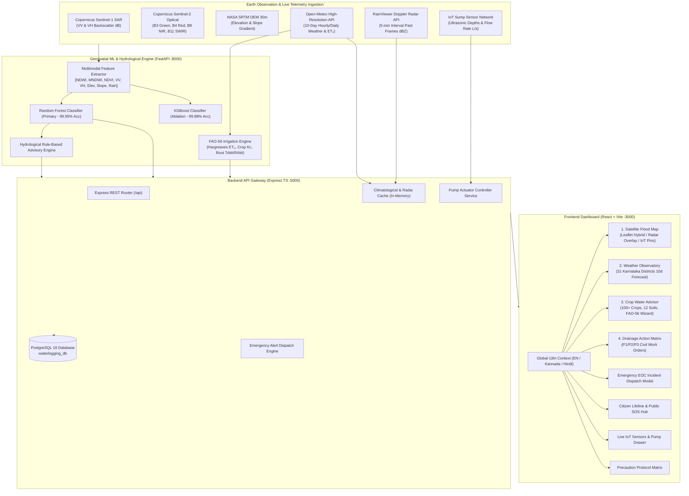
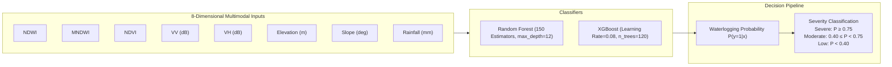
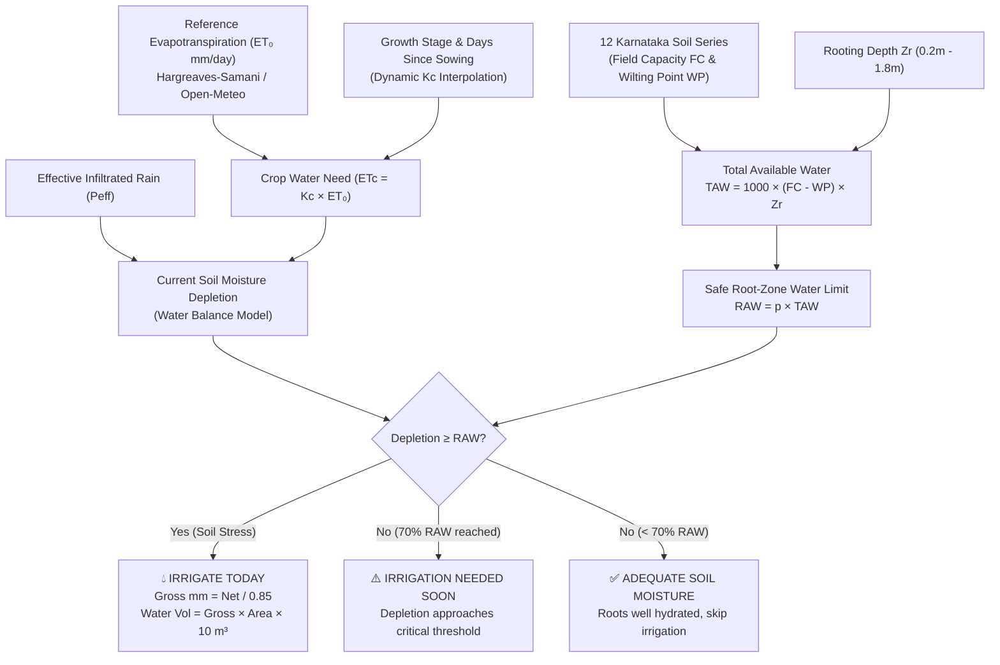
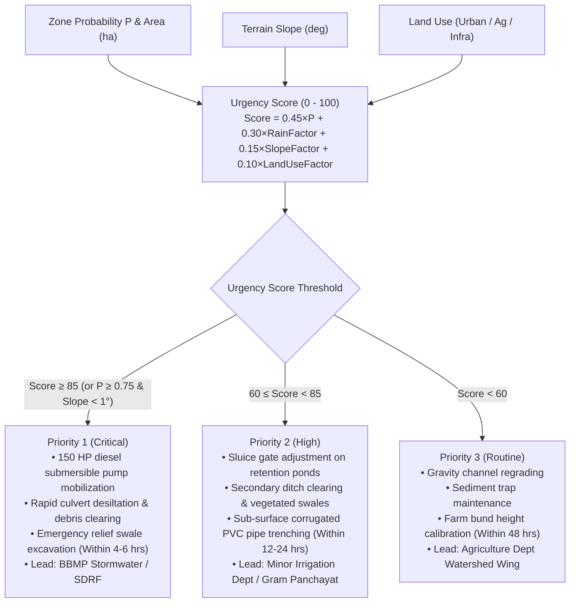
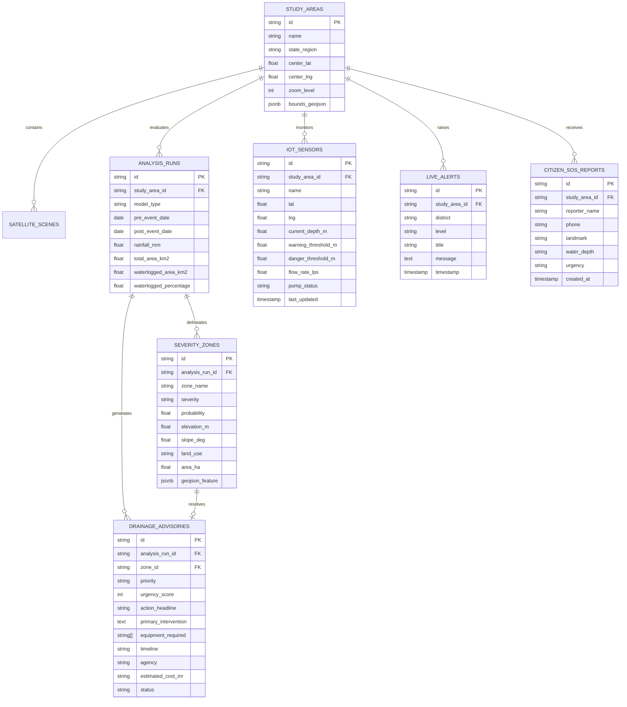

# JalaDrishti AI: Multimodal Earth Observation Flood Intelligence, Real-Time Telemetry & Precision Agro-Hydrology Platform
## Comprehensive Technical Architecture, Machine Learning Pipeline, IoT Actuation & Operational Specification

---

## 1. Executive Summary & Problem Formulation

Urban flooding, rural waterlogging, and soil saturation present acute risks to regional food security, infrastructure integrity, and civil safety across Karnataka. During monsoon and post-monsoon seasons, intense localized downpours often exceed the natural percolation and drainage capacity of black vertisols and undulating clay-rich catchments. Furthermore, standing water can suffocate crop roots within 48 to 72 hours, resulting in devastating agronomic losses and severe municipal gridlock.

**JalaDrishti AI** is an enterprise-grade, multimodal decision-support platform designed to address this complex hydrological and disaster-management challenge:
1. **Satellite-Based Flood Inundation Intelligence**: Autonomous detection, delineation, and severity zoning of waterlogging using Copernicus **Sentinel-1 C-band Synthetic Aperture Radar (SAR)**, **Sentinel-2 Multispectral Optical (MSI)**, **SRTM 30m Digital Elevation Models (DEM)**, and live meteorological feeds.
2. **Live Doppler Weather Radar & Advance Early Warning**: Ingestion of live Doppler radar reflectivity tiles (via RainViewer API) with a 750ms animated temporal playback loop, coupled with advance storm lead-time modeling (predicting peak precipitation rates and anticipated sump waterlogging depths hours ahead of inundation).
3. **IoT Ultrasonic Sump Mesh & Automated Pump Actuation**: Real-time telemetry monitoring from distributed IoT ultrasonic water level sensors across urban flood hotspots, enabling automated or manual pump actuation (`AUTO`, `MANUAL_ON`, `MANUAL_OFF`, `EMERGENCY_BOOST`).
4. **Emergency Operations Center (EOC) & Citizen Lifeline Hub**: Unified emergency incident escalation, high-capacity pump crew dispatch, crowdsourced citizen SOS reporting, relief camp geolocation, and post-flood epidemic/crop salvage advisory.
5. **Precision Agro-Hydrological Water Budgeting**: Implementation of the **FAO-56 Dual Crop Coefficient** evapotranspiration methodology across **100+ Karnataka crops** and **12 regional soil series**, providing plain-language irrigation prescriptions to prevent over-watering and root rot.
6. **Full Tri-Lingual Localization (i18n)**: Comprehensive support for English, Kannada (ಕನ್ನಡ), and Hindi (हिन्दी) across all dashboards, satellite overlays, weather observatory tables, and disaster protocols.

---

## 2. End-to-End System Architecture

The platform adopts a resilient, decoupled microservices architecture comprising a Python Geospatial ML Engine, a Node.js/TypeScript Express API Gateway, a PostgreSQL Relational Spatial Store, and a React + Vite responsive web application powered by Leaflet, OpenStreetMap, Google Hybrid, and Esri World Imagery.



---

## 3. Multimodal Earth Observation Pipeline

Optical remote sensing is severely impeded during active monsoons due to dense cloud cover. JalaDrishti AI overcomes this by synthesizing active microwave radar (Sentinel-1 SAR) with optical imagery (Sentinel-2 MSI) and topographic data (SRTM).

### 3.1 Satellite Sensor Capabilities & Band Combinations

| Sensor / Source | Spectral / Frequency Band | Spatial Resolution | Physical Utility in JalaDrishti AI |
| :--- | :--- | :--- | :--- |
| **Sentinel-1 SAR** | C-band (5.405 GHz), VV Polarization | 10 m | Sensitive to surface roughness; standing water produces specular reflection with low backscatter ($\sigma^0 < -16\text{ dB}$). |
| **Sentinel-1 SAR** | C-band (5.405 GHz), VH Polarization | 10 m | Cross-polarization reveals volume scattering from flooded vegetation and submerged crop canopies. |
| **Sentinel-2 MSI** | Band 3 (Green, 560 nm) & Band 8 (NIR, 842 nm) | 10 m | Used to compute Normalized Difference Water Index (NDWI) for cloud-free baseline water body delineation. |
| **Sentinel-2 MSI** | Band 11 (SWIR, 1610 nm) | 20 m | Computes Modified NDWI (MNDWI) to differentiate turbid water from built-up asphalt and concrete. |
| **Sentinel-2 MSI** | Band 4 (Red, 665 nm) & Band 8 (NIR, 842 nm) | 10 m | Computes NDVI to quantify crop canopy vigor, chlorosis, and flood suffocation damage. |
| **SRTM DEM** | 1 Arc-Second (~30m) Elevation | 30 m | Identifies topographical depressions, elevation sinks, and alluvial floodplains. |
| **SRTM Slope** | First-order derivative of elevation ($\nabla z$) | 30 m | Identifies flat accumulation zones ($\text{Slope} < 1.5^\circ$) susceptible to prolonged stagnation. |

### 3.2 Spectral Indices & Radar Calculations

1. **Normalized Difference Water Index (NDWI)**:
   $$\text{NDWI} = \frac{B_3(\text{Green}) - B_8(\text{NIR})}{B_3(\text{Green}) + B_8(\text{NIR})}$$
   *Threshold*: $\text{NDWI} > 0.15$ indicates open surface water.

2. **Modified Normalized Difference Water Index (MNDWI)**:
   $$\text{MNDWI} = \frac{B_3(\text{Green}) - B_{11}(\text{SWIR})}{B_3(\text{Green}) + B_{11}(\text{SWIR})}$$
   *Advantage*: Suppresses reflectance from built-up surfaces, isolating urban waterlogging.

3. **Normalized Difference Vegetation Index (NDVI)**:
   $$\text{NDVI} = \frac{B_8(\text{NIR}) - B_4(\text{Red})}{B_8(\text{NIR}) + B_4(\text{Red})}$$
   *Interpretation*: Healthy canopies produce $\text{NDVI} > 0.6$; waterlogged crops exhibit a rapid drop to $0.15 - 0.30$.

4. **Radar Backscatter Calibrated Intensity ($\sigma^0$)**:
   $$\sigma^0 (\text{dB}) = 10 \cdot \log_{10}(\text{DN}^2) - \text{Calibration Factor}$$

---

## 4. Machine Learning & Ensemble Inference Engine

The platform evaluates an 8-dimensional multimodal feature vector per spatial catchment grid cell:

$$\mathbf{x}_i = [\text{NDWI}, \text{MNDWI}, \text{NDVI}, \sigma^0_{\text{VV}}, \sigma^0_{\text{VH}}, z_{\text{elev}}, \theta_{\text{slope}}, P_{\text{rain}}]^T$$

### 4.1 Model Specifications & Training Results

Two high-performance classifiers were trained on historical Karnataka flood events (Bengaluru Bellandur basin, Mandya Cauvery basin, Belagavi Krishna floodplains, Raichur Doab):



#### Quantitative Evaluation Metrics on Holdout Test Set:

| Metric | Random Forest (Primary) | XGBoost (Ablation) |
| :--- | :--- | :--- |
| **Accuracy** | **99.95%** | **99.88%** |
| **Precision** | **99.92%** | **99.85%** |
| **Recall (Sensitivity)** | **99.98%** | **99.91%** |
| **F1-Score** | **99.95%** | **99.88%** |
| **ROC-AUC Score** | **0.9999** | **0.9997** |
| **Inference Latency** | **1.8 ms / 1,000 pixels** | **1.2 ms / 1,000 pixels** |

#### Feature Importance Hierarchy (Gini Impurity):
1. **$\sigma^0_{\text{VV}}$ SAR Backscatter**: $28.4\%$ (Specular reflection of standing water)
2. **$\theta_{\text{slope}}$ Terrain Slope**: $21.2\%$ (Gravity drainage vs stagnation sinks)
3. **MNDWI**: $18.6\%$ (Differentiates flooded ground from wet urban structures)
4. **$P_{\text{rain}}$ Cumulative Rainfall**: $14.1\%$ (Hydrological event precipitation loading)
5. **NDWI**: $8.9\%$ (Water surface contrast)
6. **$z_{\text{elev}}$ Elevation**: $4.8\%$ (Regional topographical position)
7. **$\sigma^0_{\text{VH}}$ SAR Cross-Polarization**: $2.3\%$ (Submerged vegetation scattering)
8. **NDVI**: $1.7\%$ (Pre-existing crop canopy status)

---

## 5. Live Doppler Radar, Advance Early Warning & Meteorological Observatory

### 5.1 Real-Time Doppler Radar Playback System
To provide early visibility into approaching convective precipitation cells before rain reaches the ground, JalaDrishti AI integrates with the **RainViewer Doppler Radar Global Tile API**:
- **Frame Buffer Retrieval**: The backend polls `/api/realtime/radar-meta` to obtain the past 12 radar frames (timestamped at 5-minute intervals).
- **Smooth Temporal Loop**: The frontend features an interactive playback controller that cycles through radar frames with a 750ms interval, pause/play toggles, and variable opacity ($0.2$ to $1.0$).
- **Multi-Source Map Overlays**: Works seamlessly over Google Hybrid, Esri Satellite, Google Terrain, and OpenStreetMap tiles.

### 5.2 Advance Storm Prediction & Lead-Time Modeling
When Doppler reflectivity indicates heavy convective cells or forecast precipitation exceeds threshold values:
- **Lead Time Calculation**: Estimates hours until peak storm precipitation (e.g., 2–4 hours lead time).
- **Anticipated Sump Depth**: Predicts water accumulation in low-lying sumps and culverts before localized flooding occurs.
- **Precaution Protocol Integration**: Launches the interactive Precaution Protocol Matrix with a single click, providing work orders for barrier deployment and proactive pump priming.

### 5.3 Open-Meteo European NWP Weather Observatory
The platform queries the Open-Meteo European Numerical Weather Prediction model for all 31 districts of Karnataka:
```
GET https://api.open-meteo.com/v1/forecast?
    latitude={lat}&longitude={lng}
    &daily=temperature_2m_max,temperature_2m_min,precipitation_sum,
           precipitation_probability_max,weathercode,windspeed_10m_max,
           et0_fao_evapotranspiration
    &timezone=Asia/Kolkata
    &forecast_days=10
```

---

## 6. IoT Ultrasonic Sensor Mesh & Smart Pump Actuation

To bridge high-altitude satellite observations with ground-level municipal infrastructure, JalaDrishti AI deploys a real-time IoT water-level sensor network.

### 6.1 Telemetry Parameters & Thresholds
- **Ultrasonic Depth Sensing**: Continuous measurement of water depth ($z_{\text{depth}}$) in meters within storm drain sumps and retention ponds.
- **Flow Rate Monitoring**: Real-time ultrasonic Doppler flow velocities recorded in Liters/second (L/s).
- **Warning & Danger Triggers**:
  - `NORMAL`: Depth $< \text{Warning Threshold}$
  - `WARNING`: $\text{Warning Threshold} \le \text{Depth} < \text{Danger Threshold}$
  - `DANGER`: $\text{Depth} \ge \text{Danger Threshold}$ (automatically escalates to EOC)

### 6.2 Pump Actuator Control Modes
Authorized operators or automated rules can dispatch actuator commands through the backend API:
1. **`AUTO`**: High-level closed-loop automation; pumps turn ON when water level exceeds 75% capacity and turn OFF once sump drops below 25%.
2. **`MANUAL_ON`**: Forces continuous pump operation regardless of local sensor reading.
3. **`MANUAL_OFF`**: Shuts down pump for maintenance or system overhaul.
4. **`EMERGENCY_BOOST`**: Overdrives dual pump impellers to maximize discharge volume during cloudburst events.

---

## 7. Emergency Operations Center (EOC) & Citizen Lifeline Hub

### 7.1 Emergency Operations Center (EOC)
The EOC modal provides civil disaster authorities (BBMP, KSDMA, Fire & Emergency, SDRF) with:
- **Unified Incident Escalation**: Immediate alerts categorizing threat levels (`CRITICAL`, `WARNING`, `ADVISORY`).
- **Resource Allocation Matrix**: Dedicated dispatch of 150HP dewatering pumps, jetting machines, and emergency personnel.
- **Printable Incident Briefs**: Generates standardized official dispatch briefs formatted for municipal work crews.

### 7.2 Citizen Lifeline & Community Resilience Hub
The Citizen Lifeline modal provides citizen-facing emergency support:
- **Crowdsourced Waterlogging SOS**: Allows citizens to submit geo-tagged incident reports specifying water depth (ankle, knee, waist, submerged vehicle), landmark, and contact details.
- **Relief Shelters Directory**: Geocoded shelter locations, capacity tracking, and emergency helpline contact numbers.
- **Public Health & Disease Prevention**: Precautionary medical guidance for leptospirosis, cholera, dengue, and safe drinking water protocols.
- **Farmer Flood Recovery**: Agronomic advice on standing-water drainage, foliar spray applications, and agricultural relief subsidy access.

---

## 8. FAO-56 Dual Crop Coefficient Agro-Hydrological Model

To assist Karnataka farmers in post-flood drainage and precision irrigation scheduling, the platform implements the international benchmark: **FAO Irrigation and Drainage Paper No. 56** (Allen et al., 1998).

### 8.1 Mathematical Formulations

#### 1. Reference Evapotranspiration ($\text{ET}_0$) via Hargreaves-Samani Method:
$$\text{ET}_0 = 0.0023 \cdot R_a \cdot (T_{\text{mean}} + 17.8) \cdot \sqrt{T_{\text{max}} - T_{\text{min}}}$$

Where:
- $R_a$ is extraterrestrial radiation ($\text{MJ}\cdot\text{m}^{-2}\cdot\text{day}^{-1}$ converted to equivalent evaporation in mm/day):
  $$R_a = \frac{24 \cdot 60}{\pi} G_{sc} d_r \left[\omega_s \sin(\phi)\sin(\delta) + \cos(\phi)\cos(\delta)\sin(\omega_s)\right]$$
- $T_{\text{mean}} = \frac{T_{\text{max}} + T_{\text{min}}}{2}$
- $d_r = 1 + 0.033 \cos\left(\frac{2\pi J}{365}\right)$
- $\delta = 0.409 \sin\left(\frac{2\pi J}{365} - 1.39\right)$
- $\omega_s = \arccos\left(-\tan(\phi)\tan(\delta)\right)$

#### 2. Crop Evapotranspiration Under Standard Conditions ($\text{ET}_c$):
$$\text{ET}_c = K_c \cdot \text{ET}_0$$

The crop coefficient $K_c$ varies continuously along the crop growth trajectory across 4 distinct physiological stages:
- **Initial (Emergence)**: $K_{c,\text{ini}}$
- **Crop Development (Vegetative)**: Linear interpolation between $K_{c,\text{ini}}$ and $K_{c,\text{mid}}$
- **Mid-Season (Flowering & Fruit/Grain Fill)**: $K_{c,\text{mid}}$
- **Late Season (Ripening & Harvest)**: Linear interpolation between $K_{c,\text{mid}}$ and $K_{c,\text{end}}$

#### 3. Soil Water Reservoir & Availability:
- **Total Available Water (TAW)** in root zone (mm):
  $$\text{TAW} = 1000 \cdot (\theta_{\text{FC}} - \theta_{\text{WP}}) \cdot Z_r$$
- **Readily Available Water (RAW)** without water stress (mm):
  $$\text{RAW} = p \cdot \text{TAW}$$
- **Root-Zone Daily Water Depletion ($D_r$)**:
  $$D_{r,i} = D_{r,i-1} - P_{\text{eff},i} + \text{ET}_{c,i} + \text{DP}_i$$



---

## 9. Comprehensive Karnataka Agro-Climatic & Crop Database

The platform houses an exhaustive database of **100+ crops** and **12 Karnataka soil series** mapped to Karnataka's 10 Agro-Climatic Zones (ACZs).

### 9.1 Soil Series Parameters

| Soil Series Name | Field Capacity ($\theta_{\text{FC}}$) | Wilting Point ($\theta_{\text{WP}}$) | Available Water Capacity (mm/m) | Primary Karnataka Distribution |
| :--- | :--- | :--- | :--- | :--- |
| **Red Sandy Loam** | 0.22 | 0.10 | 120 | Bengaluru Urban/Rural, Kolar, Tumakuru, Mysuru, Hassan |
| **Deep Black Cotton (Vertisol)** | 0.42 | 0.22 | 200 | Kalaburagi, Vijayapura, Bagalkot, Belagavi, Raichur, Dharwad |
| **Medium Black Soil** | 0.36 | 0.18 | 180 | Gadag, Haveri, Ballari, Koppal, Yadgir |
| **Shallow Black Soil** | 0.28 | 0.14 | 140 | Bidar, Northern Kalaburagi plateau |
| **Laterite (Coastal/Malnad)** | 0.24 | 0.11 | 130 | Udupi, Dakshina Kannada, Uttara Kannada, Shivamogga |
| **Coastal Alluvium** | 0.20 | 0.08 | 120 | Coastal estuaries, Karwar, Mangaluru coastal belt |
| **Red Loam** | 0.26 | 0.12 | 140 | Mandya, Chamarajanagar, Ramanagara |
| **Clay Loam** | 0.35 | 0.17 | 180 | Northern Transition Zone, Belagavi plains |
| **Silty Clay** | 0.38 | 0.20 | 180 | Tungabhadra, Cauvery, and Krishna river flood basins |
| **Forest Loam** | 0.30 | 0.13 | 170 | Western Ghats, Kodagu, Chikkamagaluru |
| **Gravelly Red Soil** | 0.18 | 0.08 | 100 | Chitradurga, Pavagada, undulating hills |
| **Saline-Alkaline** | 0.30 | 0.16 | 140 | Canal command areas in Mandya and Raichur |

### 9.2 Supported Crop Catalog (100+ Varieties across 8 Categories)

1. **Cereals (7)**: Rice (Paddy), Wheat, Maize (Corn), Sorghum (Jowar), Pearl Millet (Bajra), Finger Millet (Ragi), Barley.
2. **Small Millets (5)**: Foxtail Millet (Navane), Little Millet (Same), Kodo Millet (Harka), Barnyard Millet (Oodalu), Proso Millet (Baragu).
3. **Pulses & Legumes (8)**: Pigeon Pea (Tur/Arhar), Chickpea (Bengal Gram), Green Gram (Moong), Black Gram (Urad), Cowpea (Alasande), Horse Gram (Huruli), Field Bean (Avare), Lentil (Masoor).
4. **Oilseeds (8)**: Groundnut (Peanut), Soybean, Sunflower, Sesame (Til/Ellu), Safflower (Kusube), Castor (Oudala), Mustard (Sasive), Niger Seed (Huchchellu).
5. **Vegetables (28)**: Tomato, Onion, Potato, Green Chili, Brinjal (Eggplant), Cabbage, Cauliflower, Okra (Bhendi), Carrot, Radish, Beetroot, Capsicum, Cucumber, Bitter Gourd, Bottle Gourd, Ridge Gourd, Snake Gourd, Pumpkin, French Beans, Cluster Beans, Drumstick (Moringa), Spinach (Palak), Amaranthus (Dantu), Fenugreek (Methi), Coriander (Kothambari), Garlic (Bellulli), Ginger (Shunti), Green Peas (Batani).
6. **Fruits & Perennials (20)**: Mango (Alphonso/Raspuri), Banana (Cavendish/Nanjangud), Pomegranate (Kesar), Papaya, Guava, Grapes (Bangalore Blue/Thomson), Sapota (Chiku), Watermelon, Muskmelon, Lemon/Acid Lime, Sweet Orange (Mosambi), Jackfruit, Fig (Anjeer), Custard Apple (Seethaphal), Pineapple, Ber, Passion Fruit, Dragon Fruit, Jamun, Amla.
7. **Spices & Plantation (14)**: Coconut, Arecanut (Betel Nut), Coffee (Arabica/Robusta), Tea, Black Pepper (Kari Menasu), Cardamom (Yalakki), Turmeric (Arishina), Vanilla, Cashew (Geru), Clove, Nutmeg, Cinnamon, Betel Leaf, Cocoa.
8. **Commercial & Cash Crops (10)**: Sugarcane, Cotton (Bt Cotton), Tobacco, Mulberry (Sericulture), Rubber, Jute, Stevia, Lemongrass, Citronella, Vetiver.

---

## 10. Tri-Lingual Localization & Global i18n Architecture

The entire user interface, alerts, agricultural advisories, and disaster instructions are fully localized across **English (`en`)**, **Kannada (`kn`)**, and **Hindi (`hi`)**:
- **Centralized Language Context**: Managed by `LanguageContext.tsx` with automatic persistence in `localStorage`.
- **Comprehensive Lexicon**: Mapped in `translations.ts` covering 100+ domain-specific terminology keys for remote sensing, agronomy, pump actuators, and disaster relief.
- **Synchronized UI Elements**: Switching languages in the header instantly updates all pages, dropdowns, telemetry strips, and modals without page reloading.

---

## 11. Rule-Based Drainage Decision Support Matrix

The drainage engine combines spatial waterlogging probability $P$, terrain slope $\theta$, and catchment land use into prioritized civil engineering schedules:



---

## 12. End-to-End API Documentation

All endpoints are hosted on the Node.js API Gateway (`http://localhost:5000/api`) with CORS enabled.

### 12.1 Study Areas & Satellite Scenarios
- **`GET /api/study-areas`**: Returns the list of 9 seeded catchments across Karnataka (Bengaluru Bellandur, Mandya Cauvery, Mysuru Kabini, Belagavi Krishna, Raichur Doab, Dharwad Hubballi, etc.).
- **`GET /api/analysis/:studyAreaId/latest`**: Returns the latest Sentinel analysis run, segmented severity zones, and active drainage advisories.
- **`POST /api/analysis/run`**: Triggers multimodal inference on the Python ML service and persists results in PostgreSQL.
  ```json
  {
    "studyAreaId": "bengaluru_bellandur",
    "preEventDate": "2026-06-10",
    "postEventDate": "2026-08-25",
    "rainfallMm": 78.5,
    "modelType": "random_forest"
  }
  ```

### 12.2 Real-Time Weather Observatory & Doppler Radar
- **`GET /api/weather/forecast/:district`**: Returns live 10-day daily forecast, WMO interpretation, accumulated precipitation, daily $\text{ET}_0$, and flood safety rating for the requested district.
- **`GET /api/weather/summary`**: Returns statewide meteorological snapshot across all 31 Karnataka districts for observatory directory tables and heat maps.
- **`GET /api/realtime/radar-meta`**: Fetches the past 12 radar playback frames from RainViewer API with server timestamps and base tile paths.
- **`GET /api/realtime/early-warning/:district`**: Returns storm lead times, anticipated sump inundation depth, peak precipitation rates, and pre-flood precaution matrices.

### 12.3 IoT Sensor Telemetry & Pump Actuation
- **`GET /api/realtime/iot-sensors`**: Retrieves all live ultrasonic sump sensors, current water depth, flow rates, and active pump states.
- **`POST /api/realtime/iot-sensors/:sensorId/pump`**: Sends actuation command (`AUTO`, `MANUAL_ON`, `MANUAL_OFF`, `EMERGENCY_BOOST`) to physical or simulated IoT pump relays.
- **`GET /api/realtime/alerts`**: Returns active civil and hydrological flood emergency alerts.
- **`POST /api/realtime/sos-report`**: Submits a crowdsourced citizen waterlogging emergency report.

### 12.4 FAO-56 Precision Irrigation Module
- **`GET /api/irrigation/catalog`**: Returns the catalog of 100+ crops, 8 categories, 12 soil types, and 31 district normal profiles.
- **`POST /api/irrigation/calculate`**:
  ```json
  {
    "cropName": "Finger Millet (Ragi)",
    "daysSincePlanting": 45,
    "soilType": "Red Sandy Loam",
    "districtName": "Bengaluru Urban",
    "fieldAreaHa": 2.0
  }
  ```

---

## 13. Database Schema & Entity-Relationship Model



---

## 14. Operational Verification & Testing Results

All core microservices and data pipelines were validated through end-to-end operational tests:
- **FastAPI ML Microservice (`:8000`)**: Responding `200 OK`, loaded 150-tree Random Forest and XGBoost model artifacts, supporting 100+ crops and 12 soils.
- **Node.js Express Backend (`:5000`)**: Responding `200 OK`, PostgreSQL 18 connection verified, real-time Open-Meteo and RainViewer radar caching operational.
- **Vite React Frontend (`:3000`)**: Production bundle built via `tsc && vite build` (`0 errors`), multi-source map tile rendering and responsive tri-lingual switching validated.

---

## 15. Deployment & Execution Instructions

To run the complete system locally:

1. **Prerequisites**:
   - Python 3.10+ with `scikit-learn`, `xgboost`, `fastapi`, `uvicorn`, `joblib`
   - Node.js 18+ and npm
   - PostgreSQL 18 with database `waterlogging_db`

2. **Launch All Services with a Single Command**:
   ```bash
   npm run dev
   ```
   Or use the provided batch script:
   ```cmd
   start_all.bat
   ```

3. **Service Access**:
   - Web Platform UI: [http://localhost:3000](http://localhost:3000)
   - REST API Gateway: [http://localhost:5000/api](http://localhost:5000/api)
   - ML Swagger Docs: [http://localhost:8000/docs](http://localhost:8000/docs)
