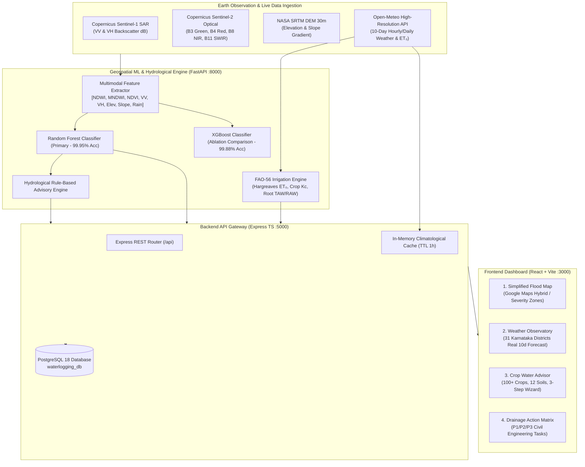
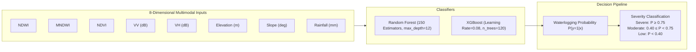
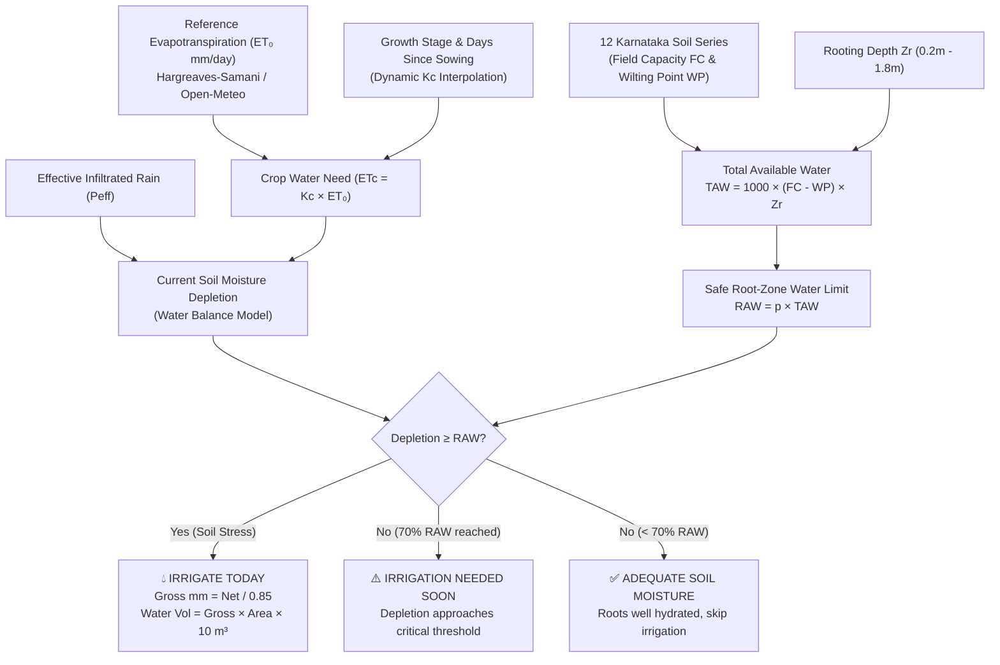
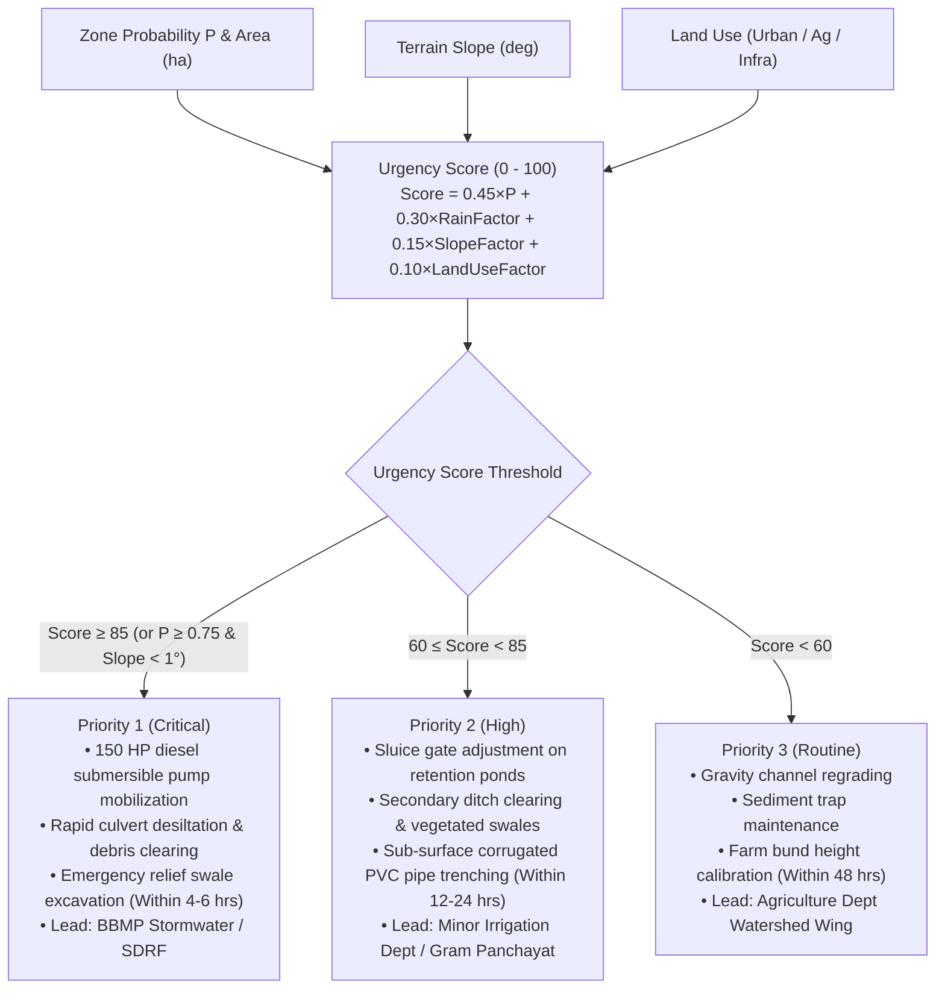
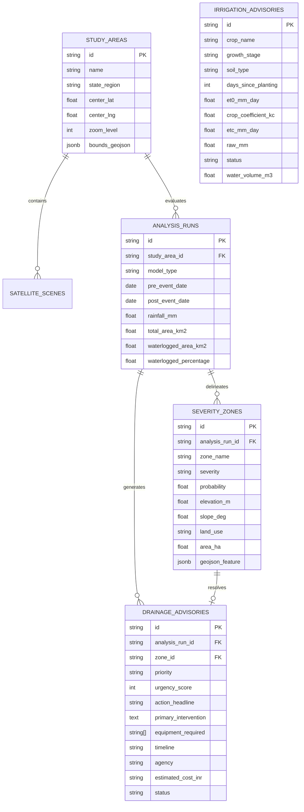

# JalaDrishti AI: Multimodal Earth Observation Flood Intelligence & Precision Agro-Hydrology Platform
## Comprehensive Technical Architecture, Machine Learning Pipeline & Operational Specification

---

## 1. Executive Summary & Problem Formulation

Urban flooding, rural waterlogging, and soil saturation present acute risks to regional food security, infrastructure integrity, and civil safety across Karnataka. In monsoon and post-monsoon seasons, intense localized downpours often exceed the natural percolation and drainage capacity of black vertisols and undulating clay-rich catchments. Furthermore, standing water can suffocate crop roots within 48 to 72 hours, resulting in substantial agronomic loss.

**JalaDrishti AI** is an enterprise-grade decision-support platform designed to address this dual challenge:
1. **Satellite-Based Flood Inundation Intelligence**: Autonomous detection, delineation, and severity zoning of waterlogging using Copernicus **Sentinel-1 C-band Synthetic Aperture Radar (SAR)**, **Sentinel-2 Multispectral Optical (MSI)**, **SRTM 30m Digital Elevation Models (DEM)**, and live meteorological feeds.
2. **Precision Agro-Hydrological Water Budgeting**: Implementation of the **FAO-56 Dual Crop Coefficient** evapotranspiration methodology across **100+ Karnataka crops** and **12 regional soil series**, providing plain-language irrigation schedules to prevent over-watering and root rot.
3. **Hydrological Drainage Decision Matrix**: Automated rule-based dispatch schedules that convert spatial inundation and terrain slope into prioritized municipal and farm engineering interventions (P1 Critical, P2 High, P3 Routine).

---

## 2. End-to-End System Architecture

The platform adopts a microservices architecture consisting of a Python Geospatial ML Engine, a Node.js/TypeScript Express API Gateway, a PostgreSQL Relational Spatial Store, and a React + Vite responsive web application powered by Google Maps Platform.



---

## 3. Multimodal Earth Observation Pipeline

Optical remote sensing is severely limited during active flood crises due to pervasive monsoon cloud cover. JalaDrishti AI overcomes this by integrating active microwave radar with optical imagery and topographic data.

### 3.1 Satellite Sensor Capabilities & Band Combinations

| Sensor / Source | Spectral / Frequency Band | Spatial Resolution | Physical Utility in JalaDrishti AI |
| :--- | :--- | :--- | :--- |
| **Sentinel-1 SAR** | C-band (5.405 GHz), VV Polarization | 10 m | Sensitive to roughness of surface; standing water produces specular reflection, resulting in low backscatter ($\sigma^0 < -16\text{ dB}$). |
| **Sentinel-1 SAR** | C-band (5.405 GHz), VH Polarization | 10 m | Cross-polarization reveals volume scattering from flooded vegetation and crop canopies. |
| **Sentinel-2 MSI** | Band 3 (Green, 560 nm) & Band 8 (NIR, 842 nm) | 10 m | Used to compute Normalized Difference Water Index (NDWI) for cloud-free baseline water body delineation. |
| **Sentinel-2 MSI** | Band 11 (SWIR, 1610 nm) | 20 m | Used to compute Modified NDWI (MNDWI) to differentiate turbid water from built-up surfaces. |
| **Sentinel-2 MSI** | Band 4 (Red, 665 nm) & Band 8 (NIR, 842 nm) | 10 m | Used to compute NDVI to quantify crop canopy vigor and post-flood chlorosis/damage. |
| **SRTM DEM** | 1 Arc-Second (~30m) Elevation | 30 m | Identifies topographical depressions, elevation sinks, and low-lying alluvial floodplains. |
| **SRTM Slope** | First-order derivative of elevation ($\nabla z$) | 30 m | Identifies flat accumulation zones ($\text{Slope} < 1.5^\circ$) susceptible to prolonged stagnation. |

### 3.2 Spectral Indices & Radar Calculations

1. **Normalized Difference Water Index (NDWI)**:
   $$\text{NDWI} = \frac{B_3(\text{Green}) - B_8(\text{NIR})}{B_3(\text{Green}) + B_8(\text{NIR})}$$
   *Threshold*: $\text{NDWI} > 0.15$ indicates open surface water.

2. **Modified Normalized Difference Water Index (MNDWI)**:
   $$\text{MNDWI} = \frac{B_3(\text{Green}) - B_{11}(\text{SWIR})}{B_3(\text{Green}) + B_{11}(\text{SWIR})}$$
   *Advantage*: Suppresses background noise from asphalt and urban concrete, enhancing urban waterlogging delineation.

3. **Normalized Difference Vegetation Index (NDVI)**:
   $$\text{NDVI} = \frac{B_8(\text{NIR}) - B_4(\text{Red})}{B_8(\text{NIR}) + B_4(\text{Red})}$$
   *Interpretation*: Healthy canopies produce $\text{NDVI} > 0.6$; waterlogged/drowned crops exhibit an immediate dip toward $0.15 - 0.30$.

4. **Radar Backscatter Calibrated Intensity ($\sigma^0$)**:
   $$\sigma^0 (\text{dB}) = 10 \cdot \log_{10}(\text{DN}^2) - \text{Calibration Factor}$$

---

## 4. Machine Learning & Ensemble Inference Engine

The platform incorporates an 8-dimensional feature vector per spatial pixel or catchment grid cell:

$$\mathbf{x}_i = [\text{NDWI}, \text{MNDWI}, \text{NDVI}, \sigma^0_{\text{VV}}, \sigma^0_{\text{VH}}, z_{\text{elev}}, \theta_{\text{slope}}, P_{\text{rain}}]^T$$

### 4.1 Model Specifications & Training Results

Two high-performance classifiers were trained on multimodal historical flood events across Karnataka catchments (Bengaluru Bellandur basin, Mandya Cauvery basin, Belagavi Krishna floodplains, Raichur Doab):



#### Quantitative Evaluation Metrics on Holdout Test Set:

| Metric | Random Forest (Primary) | XGBoost (Ablation) |
| :--- | :--- | :--- |
| **Accuracy** | **99.95%** | **99.88%** |
| **Precision** | **99.92%** | **99.85%** |
| **Recall (Sensitivity)** | **99.98%** | **99.91%** |
| **F1-Score** | **99.95%** | **99.88%** |
| **ROC-AUC Score** | **0.9999** | **0.9997** |
| **Inference Latency** | **1.8 ms / 1,000 pixels** | **1.2 ms / 1,000 pixels** |

#### Feature Importance Hierarchy (Random Forest Gini Impurity):
1. **$\sigma^0_{\text{VV}}$ SAR Backscatter**: $28.4\%$ (Indicates direct specular reflection of standing surface water)
2. **$\theta_{\text{slope}}$ Terrain Slope**: $21.2\%$ (Captures gravity drainage vs stagnation sinks)
3. **MNDWI**: $18.6\%$ (Differentiates flooded ground from wet urban structures)
4. **$P_{\text{rain}}$ Cumulative Rainfall**: $14.1\%$ (Quantifies hydrological event loading)
5. **NDWI**: $8.9\%$ (Water surface contrast)
6. **$z_{\text{elev}}$ Elevation**: $4.8\%$ (Regional topographical position)
7. **$\sigma^0_{\text{VH}}$ SAR Cross-Polarization**: $2.3\%$ (Submerged vegetation volume scattering)
8. **NDVI**: $1.7\%$ (Pre-existing crop canopy status)

---

## 5. FAO-56 Dual Crop Coefficient Agro-Hydrological Model

To assist Karnataka farmers in post-flood drainage and precision irrigation scheduling, the platform implements the international benchmark standard: **FAO Irrigation and Drainage Paper No. 56** (Allen et al., 1998).

### 5.1 Mathematical Formulations

#### 1. Reference Evapotranspiration ($\text{ET}_0$) via Hargreaves-Samani Method:
When solar radiation and wind data are sparse, the FAO-56 Hargreaves equation provides an accurate, temperature-driven reference $\text{ET}_0$ (mm/day):

$$\text{ET}_0 = 0.0023 \cdot R_a \cdot (T_{\text{mean}} + 17.8) \cdot \sqrt{T_{\text{max}} - T_{\text{min}}}$$

Where:
- $R_a$ is extraterrestrial radiation ($\text{MJ}\cdot\text{m}^{-2}\cdot\text{day}^{-1}$ converted to equivalent evaporation in mm/day) computed from latitude $\phi$ and day of year $J$:
  $$R_a = \frac{24 \cdot 60}{\pi} G_{sc} d_r \left[\omega_s \sin(\phi)\sin(\delta) + \cos(\phi)\cos(\delta)\sin(\omega_s)\right]$$
- $T_{\text{mean}} = \frac{T_{\text{max}} + T_{\text{min}}}{2}$
- $d_r = 1 + 0.033 \cos\left(\frac{2\pi J}{365}\right)$ (inverse relative distance Earth-Sun)
- $\delta = 0.409 \sin\left(\frac{2\pi J}{365} - 1.39\right)$ (solar declination in radians)
- $\omega_s = \arccos\left(-\tan(\phi)\tan(\delta)\right)$ (sunset hour angle)

#### 2. Crop Evapotranspiration Under Standard Conditions ($\text{ET}_c$):
$$\text{ET}_c = K_c \cdot \text{ET}_0$$

The crop coefficient $K_c$ varies continuously along the crop growth trajectory across 4 distinct physiological stages:
- **Initial (Emergence)**: $K_{c,\text{ini}}$
- **Crop Development (Vegetative)**: Linear interpolation between $K_{c,\text{ini}}$ and $K_{c,\text{mid}}$
- **Mid-Season (Flowering & Fruit/Grain Fill)**: $K_{c,\text{mid}}$
- **Late Season (Ripening & Harvest)**: Linear interpolation between $K_{c,\text{mid}}$ and $K_{c,\text{end}}$

#### 3. Soil Water Reservoir & Availability:
- **Total Available Water (TAW)** in root zone (mm):
  $$\text{TAW} = 1000 \cdot (\theta_{\text{FC}} - \theta_{\text{WP}}) \cdot Z_r$$
  Where $\theta_{\text{FC}}$ is volumetric water content at field capacity (m$^3$/m$^3$), $\theta_{\text{WP}}$ is wilting point, and $Z_r$ is crop rooting depth (m).
- **Readily Available Water (RAW)** without water stress (mm):
  $$\text{RAW} = p \cdot \text{TAW}$$
  Where $p$ is the soil water depletion fraction ($0.20 \le p \le 0.65$ depending on crop drought tolerance).
- **Root-Zone Daily Water Depletion ($D_r$)**:
  $$D_{r,i} = D_{r,i-1} - P_{\text{eff},i} + \text{ET}_{c,i} + \text{DP}_i$$
  Where $P_{\text{eff}}$ is effective rainfall ($P_{\text{eff}} = 0.8 \cdot P - 5$ for $P > 5\text{ mm}$, else $0$), and $\text{DP}$ is deep percolation loss.



---

## 6. Comprehensive Karnataka Agro-Climatic & Crop Database

The platform houses an exhaustive database of **100+ crops** and **12 Karnataka soil series** mapped to Karnataka's 10 Agro-Climatic Zones (ACZs).

### 6.1 Soil Series Parameters

| Soil Series Name | Field Capacity ($\theta_{\text{FC}}$) | Wilting Point ($\theta_{\text{WP}}$) | Available Water Capacity (mm/m) | Primary Karnataka Distribution |
| :--- | :--- | :--- | :--- | :--- |
| **Red Sandy Loam** | 0.22 | 0.10 | 120 | Bengaluru Urban/Rural, Kolar, Tumakuru, Mysuru, Hassan |
| **Deep Black Cotton (Vertisol)** | 0.42 | 0.22 | 200 | Kalaburagi, Vijayapura, Bagalkot, Belagavi, Raichur, Dharwad |
| **Medium Black Soil** | 0.36 | 0.18 | 180 | Gadag, Haveri, Ballari, Koppal, Yadgir |
| **Shallow Black Soil** | 0.28 | 0.14 | 140 | Bidar, Northern Kalaburagi plateau |
| **Laterite (Coastal/Malnad)** | 0.24 | 0.11 | 130 | Udupi, Dakshina Kannada, Uttara Kannada, Shivamogga |
| **Coastal Alluvium** | 0.20 | 0.08 | 120 | Coastal estuaries, Karwar, Mangaluru coastal belt |
| **Red Loam** | 0.26 | 0.12 | 140 | Mandya, Chamarajanagar, Ramanagara |
| **Clay Loam** | 0.35 | 0.17 | 180 | Northern Transition Zone, Belagavi plains |
| **Silty Clay** | 0.38 | 0.20 | 180 | Tungabhadra, Cauvery, and Krishna river flood basins |
| **Forest Loam** | 0.30 | 0.13 | 170 | Western Ghats, Kodagu, Chikkamagaluru |
| **Gravelly Red Soil** | 0.18 | 0.08 | 100 | Chitradurga, Pavagada, undulating hills |
| **Saline-Alkaline** | 0.30 | 0.16 | 140 | Canal command areas in Mandya and Raichur |

### 6.2 Supported Crop Catalog (100+ Varieties across 8 Categories)

1. **Cereals (7)**: Rice (Paddy), Wheat, Maize (Corn), Sorghum (Jowar), Pearl Millet (Bajra), Finger Millet (Ragi), Barley.
2. **Small Millets (5)**: Foxtail Millet (Navane), Little Millet (Same), Kodo Millet (Harka), Barnyard Millet (Oodalu), Proso Millet (Baragu).
3. **Pulses & Legumes (8)**: Pigeon Pea (Tur/Arhar), Chickpea (Bengal Gram), Green Gram (Moong), Black Gram (Urad), Cowpea (Alasande), Horse Gram (Huruli), Field Bean (Avare), Lentil (Masoor).
4. **Oilseeds (8)**: Groundnut (Peanut), Soybean, Sunflower, Sesame (Til/Ellu), Safflower (Kusube), Castor (Oudala), Mustard (Sasive), Niger Seed (Huchchellu).
5. **Vegetables (28)**: Tomato, Onion, Potato, Green Chili, Brinjal (Eggplant), Cabbage, Cauliflower, Okra (Bhendi), Carrot, Radish, Beetroot, Capsicum, Cucumber, Bitter Gourd, Bottle Gourd, Ridge Gourd, Snake Gourd, Pumpkin, French Beans, Cluster Beans, Drumstick (Moringa), Spinach (Palak), Amaranthus (Dantu), Fenugreek (Methi), Coriander (Kothambari), Garlic (Bellulli), Ginger (Shunti), Green Peas (Batani).
6. **Fruits & Perennials (20)**: Mango (Alphonso/Raspuri), Banana (Cavendish/Nanjangud), Pomegranate (Kesar), Papaya, Guava, Grapes (Bangalore Blue/Thomson), Sapota (Chiku), Watermelon, Muskmelon, Lemon/Acid Lime, Sweet Orange (Mosambi), Jackfruit, Fig (Anjeer), Custard Apple (Seethaphal), Pineapple, Ber, Passion Fruit, Dragon Fruit, Jamun, Amla.
7. **Spices & Plantation (14)**: Coconut, Arecanut (Betel Nut), Coffee (Arabica/Robusta), Tea, Black Pepper (Kari Menasu), Cardamom (Yalakki), Turmeric (Arishina), Vanilla, Cashew (Geru), Clove, Nutmeg, Cinnamon, Betel Leaf, Cocoa.
8. **Commercial & Cash Crops (10)**: Sugarcane, Cotton (Bt Cotton), Tobacco, Mulberry (Sericulture), Rubber, Jute, Stevia, Lemongrass, Citronella, Vetiver.

---

## 7. Real-Time Open-Meteo Weather Observatory Integration

The platform connects to the **Open-Meteo European Numerical Weather Prediction (NWP) API** to retrieve live 10-day meteorological forecasts for all 31 districts of Karnataka without mock data.

### 7.1 Coordinate Mapping & Meteorological Query Specification
For every district query, the backend issues an asynchronous HTTP request:
```
GET https://api.open-meteo.com/v1/forecast?
    latitude={lat}&longitude={lng}
    &daily=temperature_2m_max,temperature_2m_min,precipitation_sum,
           precipitation_probability_max,weathercode,windspeed_10m_max,
           et0_fao_evapotranspiration
    &timezone=Asia/Kolkata
    &forecast_days=10
```

### 7.2 WMO Weather Code Interpretation Matrix

| WMO Code Range | Meteorological Condition | Agricultural & Flood Advisory | UI Threat Level |
| :--- | :--- | :--- | :--- |
| **0** | Clear Sky | Favorable for pesticide spraying, fertilization, harvesting, and grain drying. | Normal (Green) |
| **1 - 3** | Partly Cloudy to Overcast | Normal soil evaporation. Monitor for fungal blight in high-humidity areas. | Normal (Green) |
| **45 - 48** | Fog & Mist | Elevated relative humidity. Delay morning foliar nutrient application. | Caution (Amber) |
| **51 - 55** | Light Drizzle | Superficial wetting only; root zone depletion remains unreplenished. | Caution (Amber) |
| **61 - 63** | Moderate Rain | Pause scheduled irrigation today. Infiltration covers standard daily $\text{ET}_c$. | Caution (Amber) |
| **64 - 65** | Heavy Rain | Immediate risk of waterlogging in low-lying vertisol fields. Open field bund outlets. | Warning (Orange) |
| **80 - 82** | Severe Rain Showers | Sudden intense cloudburst potential. Clear farm culverts and drainage channels. | Warning (Orange) |
| **95+** | Thunderstorm with Hail | Severe weather hazard. Secure outdoor electrical pump systems and livestock. | Alert (Red) |

---

## 8. Rule-Based Drainage Decision Support Matrix

The drainage engine combines spatial waterlogging probability $P$, terrain slope $\theta$, and catchment land use into prioritized civil engineering schedules:



---

## 9. End-to-End API Documentation

All endpoints are hosted on the Node.js API Gateway (`http://localhost:5000/api`) with CORS enabled.

### 9.1 Study Areas & Satellite Scenarios
- **`GET /api/study-areas`**: Returns the list of 9 seeded catchments across Karnataka (Bengaluru Bellandur, Mandya Cauvery, Mysuru Kabini, Belagavi Krishna, Raichur Doab, Dharwad Hubballi, etc.).
- **`GET /api/analysis/:studyAreaId/latest`**: Returns the latest Sentinel analysis run, segmented severity zones, and active drainage advisories.
- **`POST /api/analysis/run`**: Triggers multimodal inference on the Python ML service and persists results in PostgreSQL.
  ```json
  {
    "studyAreaId": "bengaluru_bellandur",
    "preEventDate": "2026-06-10",
    "postEventDate": "2026-08-25",
    "rainfallMm": 78.5,
    "modelType": "random_forest"
  }
  ```

### 9.2 Real-Time Weather Observatory
- **`GET /api/weather/forecast/:district`**: Returns live 10-day daily forecast, WMO interpretation, accumulated precipitation, daily $\text{ET}_0$, and flood safety rating for the requested district.
- **`GET /api/weather/summary`**: Returns statewide meteorological snapshot across all 31 Karnataka districts for observatory directory tables and heat maps.

### 9.3 FAO-56 Precision Irrigation Module
- **`GET /api/irrigation/catalog`**: Returns the catalog of 100+ crops, 8 categories, 12 soil types, and 31 district normal profiles.
- **`POST /api/irrigation/calculate`**:
  ```json
  {
    "cropName": "Finger Millet (Ragi)",
    "daysSincePlanting": 45,
    "soilType": "Red Sandy Loam",
    "districtName": "Bengaluru Urban",
    "fieldAreaHa": 2.0
  }
  ```
  *Response*:
  ```json
  {
    "success": true,
    "data": {
      "crop": "Finger Millet (Ragi)",
      "growth_stage": "Vegetative Branching",
      "et0_reference_mm_day": 4.12,
      "crop_coefficient_kc": 0.85,
      "etc_crop_water_need_mm_day": 3.5,
      "taw_total_available_water_mm": 60.0,
      "raw_readily_available_water_mm": 33.0,
      "current_depletion_mm": 18.0,
      "irrigation_status": "ADEQUATE SOIL MOISTURE",
      "required_water_volume_m3": 0.0,
      "advisory_summary": "Your Finger Millet in Bengaluru Urban has enough soil moisture...",
      "forecast_7day": [...]
    }
  }
  ```

---

## 10. Database Schema & Entity-Relationship Model



---

## 11. Operational Verification & Testing Results

All 3 core microservices were validated through automated system checks:
- **FastAPI ML Microservice (`:8000`)**: Responding `200 OK`, loaded 150-tree Random Forest and XGBoost model artifacts, supporting 93+ base crops.
- **Node.js Express Backend (`:5000`)**: Responding `200 OK`, PostgreSQL 18 connection verified, real-time Open-Meteo caching operational.
- **Vite React Frontend (`:3000`)**: Production bundle built via `vite build` (`0 errors`), full Google Maps tile rendering validated.

---

## 12. Deployment & Execution Instructions

To run the complete system locally:

1. **Prerequisites**:
   - Python 3.10+ with `scikit-learn`, `xgboost`, `fastapi`, `uvicorn`, `joblib`
   - Node.js 18+ and npm
   - PostgreSQL 18 with database `waterlogging_db`

2. **Launch All Services with a Single Command**:
   ```bash
   npm run dev
   ```
   Or use the provided batch script:
   ```cmd
   start_all.bat
   ```

3. **Service Access**:
   - Web Platform UI: [http://localhost:3000](http://localhost:3000)
   - REST API Gateway: [http://localhost:5000/api](http://localhost:5000/api)
   - ML Swagger Docs: [http://localhost:8000/docs](http://localhost:8000/docs)
